# 1. Specimen Bioseq Information Managment System

Are you still struggling with how to manage different specimen and sequence information?
Such kind of work is overwhelming, especially when there are a lot of specimens.

As a researcher, we'd like to record all the information on specimen collection,
taxonomical identificaion, DNA/RNA extraction, Library construction, sequencing
and biological sequences etc.

I've been searching over the Internet, but found none of them meet my desires,
therefore, I developed this **Specimen Bioseq Information Managment System** (or called **Specimen Bioseq System** for convenience).

What is **Specimen Bioseq Information Managment System** able to do?
It can record:

* Voucher information (e.g. Field ID, Museum voucher ID, Instituion Storing, Donor)
* Taxonomical identification (e.g. Family, genus, NCBI taxid, identifier)
* Collection information (e.g. collector, date, collecting sites)
* Specimen information (e.g. individuals, sex, life stage, storage condition)
* Project information (e.g. project name, project description)
* DNA/RNA information (e.g. test result, concentration, volume)
* DNA/RNA Library information (e.g. test result, concentration, volume)
* DNA/RNA Sequencing information (e.g. library ID, sequencing volume, data path, filter parameters)
* NCBI information (e.g. BioProject ID, BioSample Accession, Sample Accession, Genome Assembly Accession)
* Sequences (e.g. genome assembly, mitogenome assembly) and link it to specimen etc

*Just record each piece of information does not make too much sense.*

Instead, the **Specimen Bioseq Information Managment System Links these information all together AUTOmatically!**

For example,
one specimen can be used by multiple projects,
one tissue specimen can be used for multiple times of DNA/RNA extraction,
or multiple tissue specimens can be pooled together before DNA/RNA extraction,
one DNA/RNA extract can be used for multiple times of DNA/RNA library construction,
or multiple DNA/RNA extracts can be pooled together before library construction,
one library can be sequenced multiple times. **All these relationship information can be AUTOmatically Linked and recorded by Specimen Bioseq Information Managment System**!

Moreover, the **Specimen Bioseq Information Managment System** support different
kinds of filtering or searching strategies (e.g. by project, taxonomy, different kinds of IDs).

If you upload annotated sequences (e.g. in GenBank format), you can even **directly download the CDS or protein sequences of the genes** as you're using NCBI!

**Besides all the above, I can also create new custom tables and linking all the existing information to it. For example, you want to record specific information for a specific project regarding your analysis steps** (See the last part)

# 2. How the Specimen Bioseq Information Managment System works?

The **Specimen Bioseq Information Managment System** provides a user-friendly website. You can create multiple users, each user with different privilege (for example, both viewing and editing, viewing only).

The user can upload data to the system with different kind format files (Excel, CSV, TSV etc.), you can also just add/update/delete records on the website.

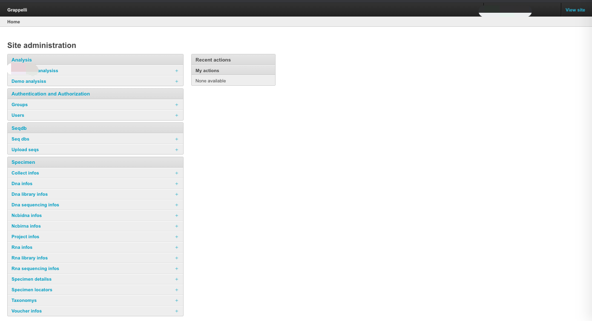
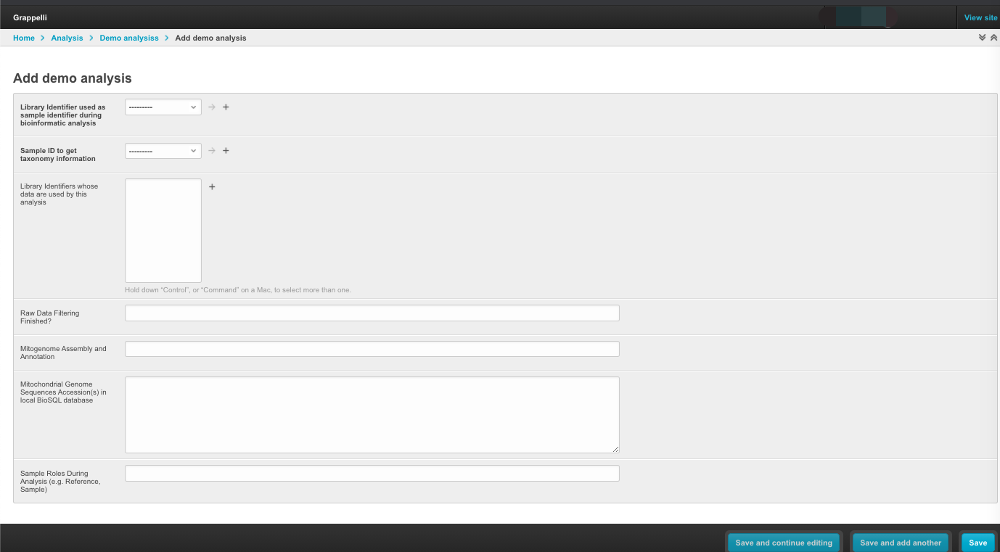
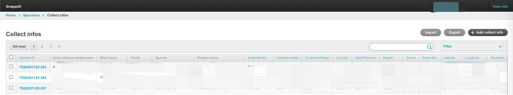
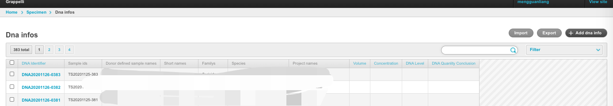
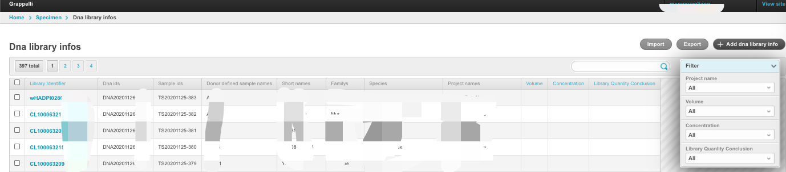
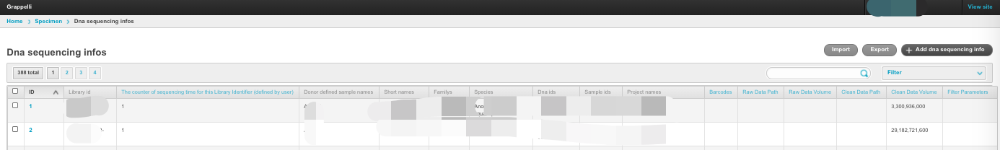
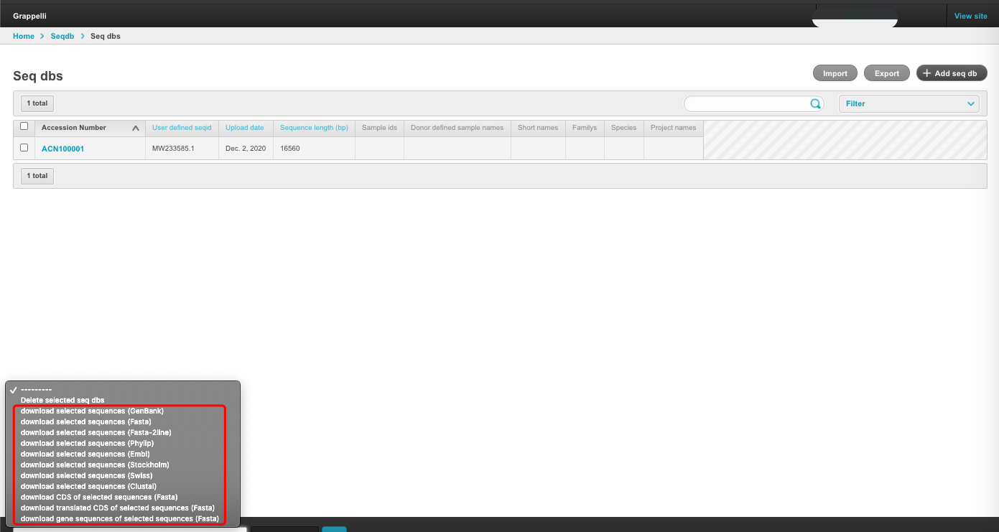
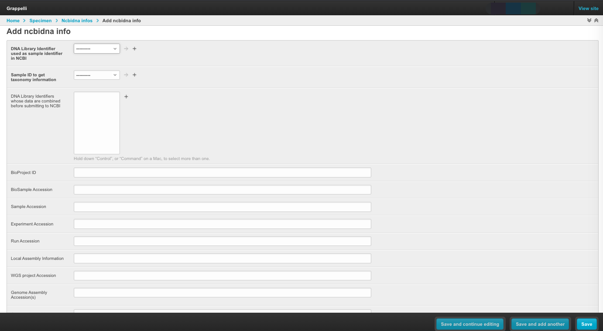
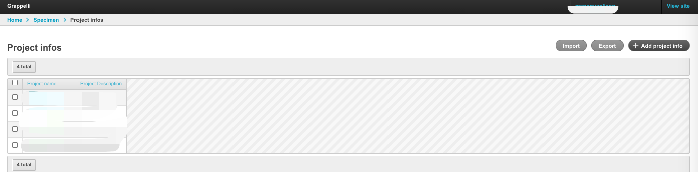
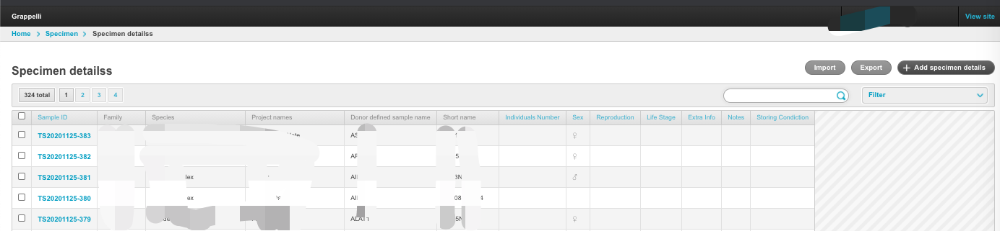
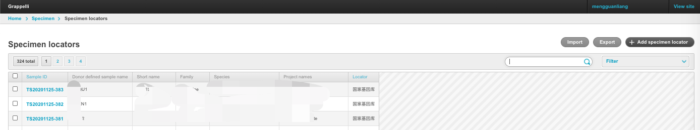
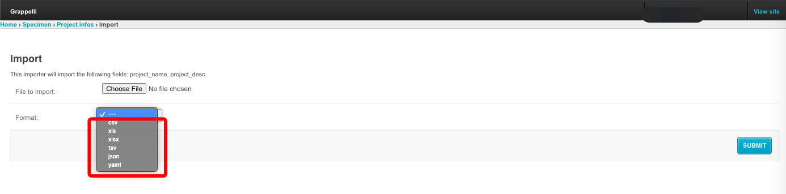
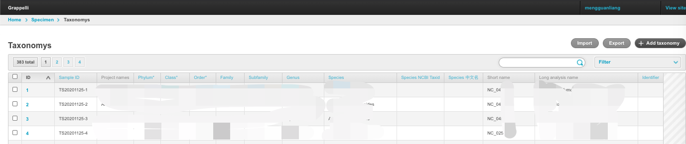
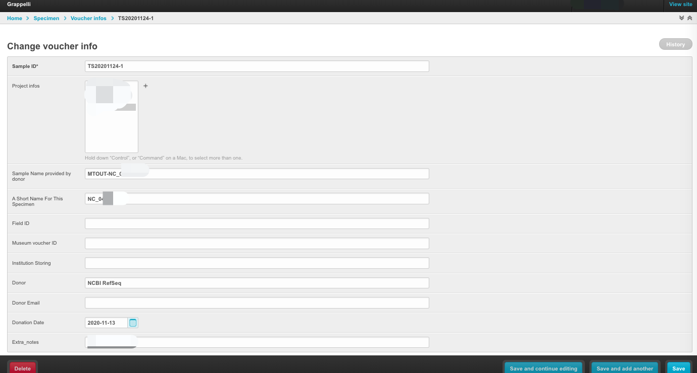
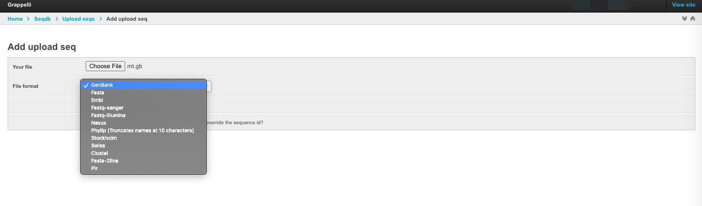
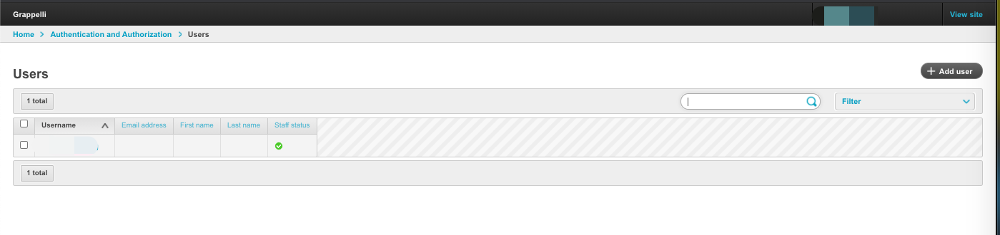
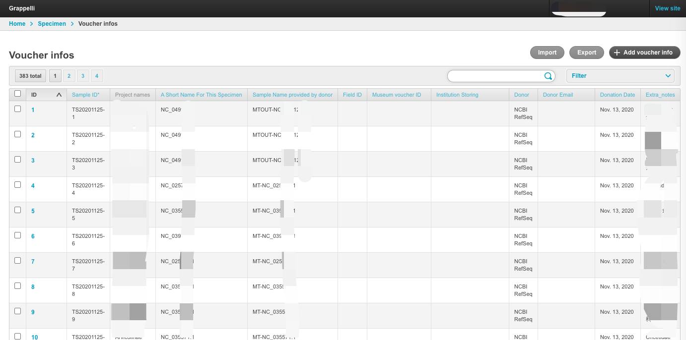

# 3. What's more

If you like this project, please give it 'stars' on Github.

If you have problems during using this program, please raise new issues on Github.

**If you want me to give support on how to install/use this program, or design your
customized modules, I would be glad to help you if you can give me
some financial support. Please contact me if you need help.**

# 4. Installation

Check the file [doc/INSTALL.md](doc/INSTALL.md).

# 5. Copyright

Copyright (c) 2020-2021 Guanliang Meng. All rights reserved.

This file is part of the Specimen Bioseq System.

The Specimen Bioseq System is free software: you can redistribute it and/or
modify it under the terms of the GNU General Public License as published by
the Free Software Foundation, either version 3 of the License, or (at your
option) any later version.

**The Specimen Bioseq System is distributed in the hope that it will be
useful, but WITHOUT ANY WARRANTY; without even the implied warranty of
MERCHANTABILITY or FITNESS FOR A PARTICULAR PURPOSE**.  See the
GNU General Public License for more details.

You should have received a copy of the GNU General Public License along with
the Specimen Bioseq System. If not, see <http://www.gnu.org/licenses/>.
